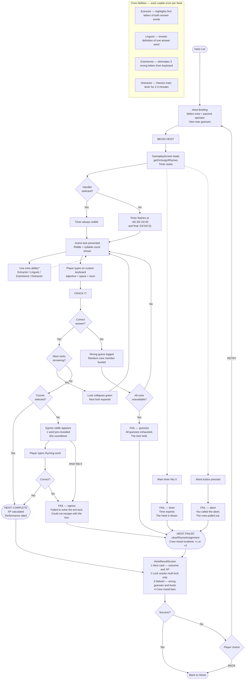

# Gameplay Flow

```mermaid
flowchart TD
    A([Heist List]) --> B[Heist Briefing\nSelect crew + passive operator\nView max guesses]
    B --> C[BEGIN HEIST]
    C --> D[GameplayScreen loads\ngetOrAssignRhymes\nTimer starts]

    D --> E{Handler\nselected?}
    E -- Yes --> F[Timer always visible]
    E -- No --> G[Timer flashes at :45/:30/:15/:00\nand final :03/:02/:01]

    F & G --> H[Active lock presented\nRiddle + syllable count shown]

    H --> ABILITY[Use crew ability?\nExtractor / Linguist / Extortionist / Distractor]
    ABILITY -.-> H

    H --> I[Player types on custom keyboard\nadjective + space + noun]
    I --> J[CRACK IT]

    J --> K{Correct\nanswer?}

    K -- Yes --> L{More locks\nremaining?}
    L -- Yes --> M[Lock collapses green\nNext lock expands]
    M --> H

    K -- No --> N[Wrong guess logged\nRandom crew member busted]
    N --> O{All crew\nunavailable?}
    O -- No --> H
    O -- Yes --> FAIL_G[FAIL — guesses\nAll guesses exhausted.\nThe lock held.]

    L -- No --> P{Courier\nselected?}

    P -- Yes --> SUCCESS

    P -- No --> Q[Egress riddle appears\n1 word pre-revealed\n60s countdown]
    Q --> R[Player types rhyming word]
    R --> S{Correct?}
    S -- Yes --> SUCCESS
    S -- No --> FAIL_E[FAIL — egress\nFailed to solve the exit lock.\nCould not escape with the loot.]
    Q -- timer hits 0 --> FAIL_E

    D -.-> TIMER_EXP[Main timer hits 0]
    D -.-> ABORT[Abort button pressed]
    TIMER_EXP --> FAIL_T[FAIL — timer\nTime expired.\nThe heist is blown.]
    ABORT --> FAIL_A[FAIL — abort\nYou called the abort.\nThe crew pulled out.]

    SUCCESS([HEIST COMPLETE\nXP calculated\nPerformance rated])
    FAIL_G & FAIL_T & FAIL_E & FAIL_A --> FAIL_COMMON

    FAIL_COMMON([HEIST FAILED\nclearRhymeAssignment\nCrew mood incidents +1 or +2])

    SUCCESS --> RS[HeistResultScreen\n1 Hero card — outcome and XP\n2 Lock results multi-lock only\n3 Debrief — wrong guesses and busts\n4 Crew mood bars]
    FAIL_COMMON --> RS

    RS --> T{Success?}
    T -- Yes --> U([Back to Heists])
    T -- No --> V{Player choice}
    V -- RETRY --> B
    V -- BACK --> U

    subgraph abilities [Crew Abilities — each usable once per heist]
        CA1[Extractor — highlights first letters of both answer words]
        CA2[Linguist — reveals definition of one answer word]
        CA3[Extortionist — eliminates 3 wrong letters from keyboard]
        CA4[Distractor — freezes main timer for 2-3 minutes]
    end
```
